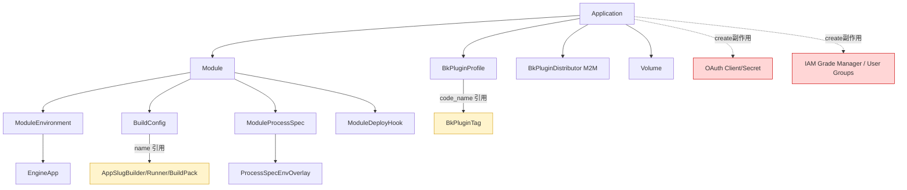

# AI Agent 应用元数据迁移 — 表迁移范围与依据设计文档

> 适用工具：`export_ai_agent_app_metadata` / `import_ai_agent_app_metadata`
> Schema 版本：v1（与导出文件 `schema_version` 字段一致）
> 代码位置：`paasng/platform/applications/ai_agent_migration/`（`exporter.py` / `importer.py` / `helpers.py`）

## 1. 目标与范围划分原则

迁移工具的目标，是把"环境 A"的某个或全部 AI Agent 应用，**以最小代价**在"环境 B"上重新立起来，使其**可以被开发者继续在控制台上看到、配置并触发部署
**。它**不**承担以下两类目标：

1. 不复制运行态产物（部署日志、镜像、构建记录、运行实例）。
2. 不接管那些必须由对应子系统（OAuth / IAM / APIGW / CFS / Monitor 等）在目标环境**重新初始化**的外部资源。

基于此，所有候选表被划分为：

- **A 类（必迁）**：开发者中心元数据，丢失后应用直接不可见或拓扑残缺。
- **B 类（部分迁，含脱敏 / 跳过外键引用）**：业务层重要但含有目标环境无法直接复用的字段（密钥、外部资源 ID 等）。
- **C 类（不迁，由目标环境自动重建）**：创建应用副作用产物，依赖目标环境的子系统（OAuth / IAM）。
- **D 类（不迁，运行态 / 审计 / 历史）**：运行时产生、与某次部署强绑定，迁移意义不大。
- **E 类（不迁，外部系统副本）**：本地表只是外部系统的 ID 索引，目标环境必须重新创建外部资源。

---

## 2. 已迁移的表（A / B 类）

### 2.1 应用主体（A 类，必迁）

| # | 表 / 模型                           | 字段（导出范围）                                                                                                                                                                                                | 迁移原因                                                                                                                                                              |
|---|----------------------------------|---------------------------------------------------------------------------------------------------------------------------------------------------------------------------------------------------------|-------------------------------------------------------------------------------------------------------------------------------------------------------------------|
| 1 | `applications.Application`       | `id, code, name, name_en, app_tenant_mode, app_tenant_id, type, is_smart_app, is_plugin_app, is_ai_agent_app, language, creator, owner, region, is_active, last_deployed_date, tenant_id`               | 应用主表，所有元数据的根。`is_ai_agent_app=True` 是工具的过滤入口与导入校验依据。                                                                                                              |
| 2 | `modules.Module`                 | `id, name, is_default, language, source_init_template, source_origin, source_type, source_repo_id, exposed_url_type, user_preferred_root_domain, last_deployed_date, creator, owner, region, tenant_id` | AI Agent 应用即使只有一个默认模块，也必须有 Module 记录，否则前端模块切换、构建配置、进程定义都无处挂载。                                                                                                     |
| 3 | `applications.ModuleEnvironment` | `environment, is_offlined, region, tenant_id`                                                                                                                                                           | 标识 stag / prod 环境的存在性；前端"部署管理"按环境维度组织，缺失则整个环境页面空白。                                                                                                                |
| 4 | `paas_wl.EngineApp`              | `name, region, is_active, owner, tenant_id`                                                                                                                                                             | 每个 ModuleEnvironment 必须挂一个 EngineApp，否则后续构建 / 部署链路无法运行。导入时通过 `ModuleInitializer._get_or_create_engine_app` 重建并保留**目标环境分配的新 ID**，仅将名称 / owner / tenant 等可移植字段同步过来。 |

### 2.2 模块编排配置（A 类，必迁）

| # | 表 / 模型                              | 字段（导出范围）                                                                                                                                                                                                          | 迁移原因                                                       |
|---|-------------------------------------|-------------------------------------------------------------------------------------------------------------------------------------------------------------------------------------------------------------------|------------------------------------------------------------|
| 5 | `modules.BuildConfig`               | `build_method, dockerfile_path, docker_build_args, image_repository, image_credential_name, tag_options, use_bk_ci_pipeline, tenant_id` + `buildpack_builder.name` / `buildpack_runner.name` / `buildpacks[name]` | 模块构建方式（Dockerfile / Buildpack / 镜像），AI Agent 大量场景依赖固定构建参数。 |
| 6 | `bkapp_model.ModuleProcessSpec`     | `name, proc_command, command, args, port, services, target_replicas, plan_name, autoscaling, scaling_config, probes, graceful_shutdown_seconds, components, tenant_id`                                            | 进程编排（含探针 / 弹性 / 资源套餐）；AI Agent 通常依赖固定的 web / worker 拓扑。    |
| 7 | `bkapp_model.ProcessSpecEnvOverlay` | `environment_name, override_plan_name, override_resources, target_replicas, plan_name, autoscaling, scaling_config, tenant_id`                                                                                    | 进程在 stag / prod 上的差异化覆盖，决定环境间副本数与资源套餐。                     |
| 8 | `bkapp_model.ModuleDeployHook`      | `type, proc_command, command, args, enabled, tenant_id`                                                                                                                                                           | 部署前 / 后置钩子（如 release_commands），属于不可重建的业务配置。                |

### 2.3 插件能力（B 类，部分迁）

| #  | 表 / 模型                              | 字段（导出范围）                                                                                                                                  | 迁移原因 / 取舍                                                                                                                                                         |
|----|-------------------------------------|-------------------------------------------------------------------------------------------------------------------------------------------|-------------------------------------------------------------------------------------------------------------------------------------------------------------------|
| 9  | `bk_plugins.BkPluginProfile`        | `introduction, contact, api_gw_name, api_gw_id, api_gw_last_synced_at, pre_distributor_codes, owner, region, tenant_id` + `tag.code_name` | AI Agent 应用同时是插件（`is_plugin_app=True`），其简介、联系人、分类必须迁移；`api_gw_id` / `api_gw_name` 仅作为引用透传，**不在目标环境创建 APIGW 实体**（参见 §3.4）。`tag` 通过 `code_name` 在目标环境查表，缺失则置空并写入告警。 |
| 10 | `bk_plugins.BkPluginDistributor` 关系 | `distributor_code_names[]`                                                                                                                | 仅迁移 M2M 关联（按 code_name），不迁移分销商主表（其本身是平台配置）。目标环境缺失对应分销商时跳过并告警。                                                                                                     |

### 2.4 AI Agent 沙箱共享卷（B 类，部分迁）

| #  | 表 / 模型                 | 字段（导出范围）                                    | 迁移原因 / 取舍                                                                                                                    |
|----|------------------------|---------------------------------------------|------------------------------------------------------------------------------------------------------------------------------|
| 11 | `agent_sandbox.Volume` | `name, display_name, deleted_at, tenant_id` | 共享卷的逻辑元数据是 AI Agent 应用业务态的一部分（卷名 → subPath 是稳定的），必须迁移以恢复"沙箱可用卷列表"。**但底层 CFS 上 `app/{uuid_hex}` 目录的文件内容不会迁移**（不在 DB，由文件系统承载）。 |

### 2.5 公共脱敏策略

§2.2 / §2.3 中的字段在导出时会过 `helpers.sanitize_sensitive`：凡 key 中含
`password / passwd / pwd / secret / token / key / private_key / credential / authorization / auth` 的标量值，会被替换为占位符
`__BKPAAS_AI_AGENT_MIGRATION_SENSITIVE_VALUE__`，导入时该字段会被跳过（保留目标环境的原始值或留空）。

---

## 3. 未迁移的表（C / D / E 类）

下列表与 AI Agent 应用强相关，但出于以下原因**不进入迁移文件**。

### 3.1 C 类：由 `create_application` 副作用自动创建

导入时调用 `paasng.platform.applications.utils.create_application` + `create_default_module`，目标环境会自然产生这些数据，无需迁移：

| 表 / 模型                                             | 不迁移的原因                                                                                                 |
|----------------------------------------------------|--------------------------------------------------------------------------------------------------------|
| `infras.iam.ApplicationGradeManager`               | 创建应用时由 IAM 子系统重新申请分级管理员 ID；环境 A 的 `grade_manager_id` 在环境 B 的 IAM 实例里**根本不存在**。                         |
| `infras.iam.ApplicationUserGroup`                  | 同上：管理者 / 开发者 / 运营者用户组 ID 由目标 IAM 重新分配。                                                                 |
| `applications.ApplicationMembership`（已 deprecated） | 仅作历史兼容，权限实际走 IAM 用户组；新建应用不再写入。                                                                         |
| `infras.oauth2`（BkAuth 远程）                         | OAuth client 与 secret 由 `create_oauth2_client` 调用 BkAuth 接口创建；secret 是目标环境 BkAuth 现场生成，**不能也不应跨环境复制**。 |
| `infras.oauth2.BkAppSecretInEnvVar`                | 仅记录"哪个 secret 写到环境变量"，依赖上面新建的 `secret_id`，不能跨环境复用。                                                     |

### 3.2 C 类：依赖目标环境的内部资源分配

| 表 / 模型                   | 不迁移的原因                                                                               |
|--------------------------|--------------------------------------------------------------------------------------|
| `paas_wl.EngineApp` 的 ID | EngineApp 名称会重建，但 UUID 主键与 `cluster` 绑定在目标环境，**不能复用**源 ID（已在 §2.1 第 4 行说明：仅迁移可移植字段）。 |
| 集群分配 / `WlAppCluster`    | 集群与目标环境的物理拓扑强绑定，由 `ModuleInitializer` 按 `--env-cluster` 映射重新分配。                      |

### 3.3 D 类：运行态 / 历史 / 审计数据

这些表的内容与"某一次部署 / 构建"绑定，对环境 B 没有意义；强行迁移反而会把"看起来已部署"的假象带过去：

| 表 / 模型                                                           | 不迁移的原因                                                                                                      |
|------------------------------------------------------------------|-------------------------------------------------------------------------------------------------------------|
| `engine.Deployment` / `engine.DeployPhase` / `engine.DeployStep` | 部署历史，绑定源环境的 EngineApp ID 与镜像。                                                                               |
| `engine.ConfigVar`                                               | **环境变量含密文**，且 `value` 用 `EncryptField` 存储，跨环境密钥不通用；通常需要在目标环境重新配置（如 LLM 厂商 token、第三方 API key），强制迁移会带来重大泄密风险。 |
| `engine.PresetEnvVariable`                                       | 来自 `app_desc.yaml` 的预设值，会随首次部署再次写入。                                                                         |
| `agent_sandbox.Sandbox` 及其状态字段                                   | 沙箱实例与 K8s Pod 强绑定，且含 `daemon_token`（敏感）。目标环境用户重新创建即可。                                                       |
| `agent_sandbox.image_build.ImageBuildRecord / ImageBuildLog`     | 镜像构建产物与日志。                                                                                                  |
| `paasng.misc.audit.AppOperationRecord` 等                         | 审计流水，按环境独立保留。                                                                                               |
| `paasng.platform.applications.UserMarkedApplication`             | 个人收藏，与具体用户绑定，无跨环境意义。                                                                                        |
| `paasng.platform.applications.ApplicationDeploymentModuleOrder`  | 个人模块排序偏好。                                                                                                   |
| `paasng.platform.applications.ApplicationFeatureFlag`            | 特性开关大多由 admin / 平台脚本按环境单独开启；如确需迁移可作为 v2 增强项（参见 §4）。                                                         |

### 3.4 E 类：本地表只是外部资源的 ID 索引

| 表 / 模型                                                   | 不迁移的原因                                                                                                             |
|----------------------------------------------------------|--------------------------------------------------------------------------------------------------------------------|
| `BkPluginProfile.api_gw_id` / `api_gw_name` 指向的 APIGW 实体 | API Gateway 是 BK-APIGW 后端的资源，跨环境必须重新声明并同步。导出时仅保留引用 ID 文本，**不调用 APIGW 接口**；导入后由插件运维侧另行同步（或重新调用 `sync_api_gateway`）。 |
| 镜像凭据（`image_credential_name`）                            | 凭据本身存在 `paasng.modules.AppUserCredential` 等表，密钥不可跨环境，导入时仅同步 `image_credential_name`，目标环境需要先存在同名凭据。                 |
| 插件分类 `BkPluginTag`                                       | 平台级配置，由管理员维护；导出仅写 `code_name`，缺失则置空 + 告警。                                                                          |
| `AppSlugBuilder` / `AppSlugRunner` / `AppBuildPack`      | 构建镜像 / runner / buildpack 是平台级注册资源；导出仅按 `name` 引用，缺失则告警。                                                           |
| `EngineApp` 关联的 K8s 命名空间、ConfigMap、Secret                | 集群侧资源，不在 PaaS DB。                                                                                                  |

---

## 4. 强相关但暂未支持的表（候选 v2）

下列表与 AI Agent 应用元数据强相关，目前**有意未迁**，列出便于评审是否需要进入下一版本：

| 表 / 模型                                           | 暂未迁移原因               | 是否建议进入 v2                                                      |
|--------------------------------------------------|----------------------|----------------------------------------------------------------|
| `engine.ConfigVar`（环境变量）                         | 含密文且需操作员二次确认         | ✅ 建议加 `--with-config-vars` 选项，默认关闭，导出时强制脱敏 + 导入时打印需要重置的 key 列表 |
| `applications.ApplicationFeatureFlag`            | 平台规则差异               | ✅ 建议带 `--with-feature-flags`，目标环境若已有同名 flag 则跳过                |
| `bkapp_model.SvcDiscConfig` / `DomainResolution` | 服务发现 / 域名解析配置        | ✅ 与进程拓扑强相关，建议进入 v2                                             |
| `modules.AppUserCredential`（仓库账号）                | 含密文                  | ⚠️ 需要导入侧人工录入                                                   |
| `engine.PresetEnvVariable`                       | 由 app_desc.yaml 自动写入 | ❌ 首次部署即重生                                                      |
| `agent_sandbox.Sandbox`（运行实例）                    | 运行态                  | ❌ 用户自行新建                                                       |
| `bk_plugins.BkPluginTag` 主表                      | 平台级配置                | ❌ 应由管理员维护                                                      |

---

## 5. 导入时的依赖图

- 黄色：仅按 name / code_name **引用**的平台资源，迁移工具不创建。
- 红色：完全不迁移，由 `create_application` 副作用产生。

---

## 6. Schema 版本与不可迁字段处理摘要

- 顶层字段：`schema_version=1`、`tool_version`、`source_env`、`exported_at`、`scope`、`applications[]`。
- 每个 application 内嵌 `uncovered_items`，明确告知操作员**当前导出文件没有携带哪些数据**（OAuth secret / 镜像凭据 /
  增强服务实例 / 部署历史 / sandbox `daemon_token` / CFS 文件内容 / APIGW 实体）。
- 敏感值统一替换为 `SENSITIVE_PLACEHOLDER`，导入时跳过该字段而非置空。
- 冲突策略（导入侧 `--conflict-strategy`）：`fail` / `skip` / `update` 三档；预检阶段把所有差异以 `diffs` 形式落入报告，便于审阅。

---

## 7. 维护说明

- 当 AI Agent 相关数据模型新增字段或新增表时，请同步更新本文件 §2 / §3 的对应表格，并在 `exporter.py` / `importer.py`
  中添加对应的处理逻辑。
- 若某次新增字段属于敏感字段，请确认其 key 命中 `helpers.SENSITIVE_KEY_HINTS` 的子串集合；若不命中需补充该集合，避免脱敏遗漏。
- 文档中的"v2 候选"项一旦进入实现，请把对应行从 §4 移到 §2，并在迁移脚本中提升 `schema_version`。
