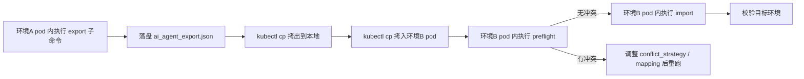

# AI Agent 应用元数据迁移 — 操作指南

> 目标读者：从环境 A（源）把若干 / 全部 AI Agent 应用的元数据搬到环境 B（目标）的运维同学。
> 配套代码：`paasng/platform/applications/ai_agent_migration/`。
> 配套设计：见同目录 [`DESIGN.md`](./DESIGN.md)。
> 所有命令均为 **shell 命令**，并明确标注执行位置（本地 / 源容器 / 目标容器）。

---

## ⚠️ 0. 命令命名说明（先读）

当前真正落盘的 management command 只有**一个**：

```
python manage.py migrate_ai_agent_metadata <export|preflight|import> [...]
```

它使用 `argparse` 子命令的方式同时承载导出、预检、导入三个动作，对应文件：

```
paasng/paasng/platform/applications/management/commands/migrate_ai_agent_metadata.py
```

> 之前规划文档中提到的 `export_ai_agent_app_metadata` / `import_ai_agent_app_metadata` **目前并不存在**。如果你确认仍要拆成两个独立命令，请在执行任何迁移前先告知，本指南会按"单命令 + 子命令"的现状描述。

---

## 1. 总体流程



每一步都对应下文的具体 shell 命令。

---

## 2. 准备工作（在你的本地机器执行）

### 2.1 准备工作目录

```shell
# 在本地任意位置执行
mkdir -p ~/work/ai-agent-migration
cd ~/work/ai-agent-migration
```

### 2.2 准备 mapping 文件（可选，但强烈建议）

`mapping.json` 内容示例（按目标环境实际情况修改值）：

```shell
# 在本地 ~/work/ai-agent-migration 目录下执行
cat > mapping.json <<'EOF'
{
  "env_cluster_mapping": {
    "stag": "default",
    "prod": "default"
  },
  "region_mapping": {
    "ieod": "default"
  },
  "root_domain_mapping": {
    "example-source.com": "example-target.com"
  }
}
EOF
```

字段含义（与 `ImportOptions` 一一对应）：

| 字段 | 作用 |
|---|---|
| `env_cluster_mapping` | 指定 stag / prod 环境的 ModuleEnvironment 在目标集群的落点。**未配置的环境会用目标环境默认分配策略，并在 preflight 报告中给出 warning**。 |
| `region_mapping` | 源环境 region → 目标环境 region 的映射，例如 `ieod → default`。 |
| `root_domain_mapping` | 模块字段 `user_preferred_root_domain` 的域名替换。 |

### 2.3 找到目标 / 源环境的 apiserver Pod

```shell
# 在本地执行；切换 kubeconfig 到对应集群后再执行
export KUBECONFIG=~/.kube/config-env-A
kubectl -n bkpaas get pods -l app.kubernetes.io/name=bkpaas3-apiserver

export KUBECONFIG=~/.kube/config-env-B
kubectl -n bkpaas get pods -l app.kubernetes.io/name=bkpaas3-apiserver
```

记录两边返回的 Pod 名，例如：

- 源环境：`SRC_POD=bkpaas3-apiserver-web-xxxxx`
- 目标环境：`DST_POD=bkpaas3-apiserver-web-yyyyy`
- 命名空间统一记为：`NS=bkpaas`

> 下文所有 `kubectl exec` / `kubectl cp` 命令都假定你已 `export` 了上述变量；如果没有，请把变量替换成实际值。

---

## 3. 导出阶段（环境 A）

### 3.1 切到环境 A 的 kubeconfig

```shell
# 在本地执行
export KUBECONFIG=~/.kube/config-env-A
export NS=bkpaas
export SRC_POD=bkpaas3-apiserver-web-xxxxx
```

### 3.2 在源 Pod 内执行导出（二选一）

#### 3.2.1 导出**单个** AI Agent 应用

```shell
# 在本地执行；命令会进入源 Pod 内运行 manage.py
kubectl -n "$NS" exec -i "$SRC_POD" -- \
  python manage.py migrate_ai_agent_metadata export \
    --app_code <YOUR_APP_CODE> \
    --source_env env-A \
    --output /tmp/ai_agent_export.json
```

#### 3.2.2 导出**全部** AI Agent 应用

```shell
# 在本地执行
kubectl -n "$NS" exec -i "$SRC_POD" -- \
  python manage.py migrate_ai_agent_metadata export \
    --all \
    --source_env env-A \
    --output /tmp/ai_agent_export.json
```

> `--app_code` 与 `--all` **必须二选一**。命令成功时会在 stdout 打印 `MigrationReport`（JSON 格式），其中 `succeeded` 列出已序列化的 app_code，`failed` 列出失败原因。

### 3.3 把导出的 JSON 拷贝到本地

```shell
# 在本地执行
kubectl -n "$NS" cp "$SRC_POD":/tmp/ai_agent_export.json ./ai_agent_export.json
```

### 3.4 在本地做基本健全性检查

```shell
# 在本地 ~/work/ai-agent-migration 目录下执行
python -c "import json; d = json.load(open('ai_agent_export.json', encoding='utf-8')); print('schema_version=', d['schema_version']); print('apps=', [a['application']['code'] for a in d['applications']])"
```

预期看到 `schema_version=1` 与一份非空的 app code 列表。

---

## 4. 跨环境传输阶段（本地 → 环境 B）

### 4.1 切到环境 B 的 kubeconfig

```shell
# 在本地执行
export KUBECONFIG=~/.kube/config-env-B
export NS=bkpaas
export DST_POD=bkpaas3-apiserver-web-yyyyy
```

### 4.2 把 JSON + mapping 文件拷入目标 Pod

```shell
# 在本地 ~/work/ai-agent-migration 目录下执行
kubectl -n "$NS" cp ./ai_agent_export.json "$DST_POD":/tmp/ai_agent_export.json
kubectl -n "$NS" cp ./mapping.json          "$DST_POD":/tmp/ai_agent_mapping.json
```

### 4.3 在目标 Pod 内确认文件存在

```shell
# 在本地执行
kubectl -n "$NS" exec "$DST_POD" -- ls -l /tmp/ai_agent_export.json /tmp/ai_agent_mapping.json
```

---

## 5. 预检阶段（环境 B，强制要求）

任何一次正式导入前**必须**先跑一次 preflight。它不写库，只输出"将会创建 / 更新 / 冲突 / 跳过"的差异报告。

### 5.1 默认策略 `fail` 预检

```shell
# 在本地执行；命令会进入目标 Pod 内运行 manage.py
kubectl -n "$NS" exec -i "$DST_POD" -- \
  python manage.py migrate_ai_agent_metadata preflight \
    --input /tmp/ai_agent_export.json \
    --mapping_file /tmp/ai_agent_mapping.json \
    --conflict_strategy fail
```

期望输出（节选）：

```json
{
  "total": 1,
  "created": [{"object_type": "Application", "object_id": "...", ...}],
  "conflicts": [],
  "warnings": [...]
}
```

### 5.2 预检失败时的常见路径

- **目标已存在同 code 应用且字段差异**：根据需要切换 `--conflict_strategy update` 或 `skip`。
- **`env_cluster_mapping` warning**：在 `mapping.json` 中补齐，避免命中默认分配策略。
- **`buildpack_builder` / `buildpack_runner` / `buildpacks` 缺失**：在目标环境先创建同名记录（admin 后台或运维脚本），再次 preflight。
- **`BkPluginTag` / `BkPluginDistributor` 缺失**：联系平台管理员补齐分类与使用方。

修正后回到 §5.1 重跑直至 conflicts 为空且 warnings 仅剩可接受的剩余项。

---

## 6. 导入阶段（环境 B）

### 6.1 全新创建（最常见场景）

```shell
# 在本地执行
kubectl -n "$NS" exec -i "$DST_POD" -- \
  python manage.py migrate_ai_agent_metadata import \
    --input /tmp/ai_agent_export.json \
    --mapping_file /tmp/ai_agent_mapping.json \
    --conflict_strategy fail \
    --operator <OPERATOR_USER_ID>
```

### 6.2 目标已存在且需要更新字段

```shell
# 在本地执行
kubectl -n "$NS" exec -i "$DST_POD" -- \
  python manage.py migrate_ai_agent_metadata import \
    --input /tmp/ai_agent_export.json \
    --mapping_file /tmp/ai_agent_mapping.json \
    --conflict_strategy update \
    --operator <OPERATOR_USER_ID>
```

### 6.3 目标已存在但本次只想补关联资源（跳过应用主表）

```shell
# 在本地执行
kubectl -n "$NS" exec -i "$DST_POD" -- \
  python manage.py migrate_ai_agent_metadata import \
    --input /tmp/ai_agent_export.json \
    --mapping_file /tmp/ai_agent_mapping.json \
    --conflict_strategy skip
```

### 6.4 触发 `post_create_application` 信号（仅创建场景）

如希望导入新应用时同步触发 IAM / OAuth 等下游初始化逻辑，加上 `--send_create_signal`：

```shell
# 在本地执行
kubectl -n "$NS" exec -i "$DST_POD" -- \
  python manage.py migrate_ai_agent_metadata import \
    --input /tmp/ai_agent_export.json \
    --mapping_file /tmp/ai_agent_mapping.json \
    --conflict_strategy fail \
    --operator <OPERATOR_USER_ID> \
    --send_create_signal
```

> ⚠️ `create_application()` 在导入器中默认就会调用、负责创建 OAuth client / IAM 用户组等，所以一般情况下**不需要**额外加 `--send_create_signal`。仅当目标环境有自定义 `post_create_application` 接收器需要被触发时才加。

### 6.5 退出码与失败处理

命令最后会打印完整 `MigrationReport`。出现以下情况会以非零退出码结束：

- `report.failed` 非空 → `CommandError("Import finished with failures.")`
- `report.has_blocking_conflicts` 为 True → `CommandError("Import blocked by conflicts.")`

排查思路：拿 stdout 中的 `failed` / `conflicts` 详情回到 §5 调整后重跑。**导入是按 application 粒度的事务**，单个失败不会污染其他成功的应用。

---

## 7. 导入后人工校验（环境 B）

下列项目**不在** payload 中，必须在目标环境单独配置：

| # | 项目 | 在哪里补 |
|---|---|---|
| 1 | 环境变量 `ConfigVar`（含 LLM / 第三方 token） | 控制台「环境配置 → 环境变量」 |
| 2 | 镜像凭据 / 仓库账号 | 控制台「模块配置 → 镜像凭据」（与导出端 `image_credential_name` 对齐） |
| 3 | 增强服务实例（如 MySQL / Redis） | 控制台「增强服务」绑定并初始化 |
| 4 | APIGW 实体（仅插件应用） | 平台同步脚本 / 由插件运维侧重新调用 `sync_api_gateway` |
| 5 | 沙箱共享卷的 CFS 文件内容 | 通过 `kubectl cp` / 业务侧脚本单独同步 `app/{uuid_hex}` 目录 |
| 6 | OAuth client secret | 控制台「应用基本信息 → 鉴权信息」处查看（已由 `create_application` 自动重建） |

### 7.1 快速校验一个应用是否就绪

```shell
# 在本地执行；切到目标环境 kubeconfig
kubectl -n "$NS" exec -i "$DST_POD" -- \
  python manage.py shell -c "
from paasng.platform.applications.models import Application
app = Application.objects.get(code='<YOUR_APP_CODE>')
print('is_ai_agent_app =', app.is_ai_agent_app)
print('modules         =', list(app.modules.values_list('name', flat=True)))
for m in app.modules.all():
    print(f'  module {m.name} envs:', list(m.envs.values_list('environment', flat=True)))
"
```

### 7.2 控制台直接打开应用页面

获取应用 code 后访问：`https://<目标环境 PaaS 域名>/developer-center/apps/<APP_CODE>/default/summary`，确认应用主体、模块、环境、进程编排、插件简介等都符合预期。

---

## 8. 回滚

### 8.1 仅回滚某个应用（推荐）

如果导入后的某个应用有问题，最干净的方式是用 `force_del_app` 命令删除后再重新导入：

```shell
# 在本地执行
kubectl -n "$NS" exec -it "$DST_POD" -- \
  python manage.py force_del_app --app_code <YOUR_APP_CODE>
```

### 8.2 整批回滚

逐个走 8.1，或直接联系 DBA 按导入时间窗回滚相关表。**没有专门的"反向导入"工具**——这是设计取舍（详见 [`DESIGN.md`](./DESIGN.md) §3）。

---

## 9. 一键脚本示例（在本地执行）

下方脚本把整套流程串起来，便于无人值守迁移：

```shell
#!/usr/bin/env bash
# 在本地任意位置保存为 migrate_ai_agent.sh，然后 chmod +x 后执行：./migrate_ai_agent.sh <APP_CODE>
set -euo pipefail

APP_CODE="${1:?usage: $0 <APP_CODE>}"
NS="${NS:-bkpaas}"
SRC_KUBECONFIG="${SRC_KUBECONFIG:-$HOME/.kube/config-env-A}"
DST_KUBECONFIG="${DST_KUBECONFIG:-$HOME/.kube/config-env-B}"
SRC_POD="${SRC_POD:?need SRC_POD env var}"
DST_POD="${DST_POD:?need DST_POD env var}"
WORKDIR="$(pwd)/ai-agent-${APP_CODE}-$(date +%Y%m%d%H%M%S)"
mkdir -p "$WORKDIR"
cd "$WORKDIR"

cat > mapping.json <<'EOF'
{"env_cluster_mapping": {"stag": "default", "prod": "default"}, "region_mapping": {}, "root_domain_mapping": {}}
EOF

KUBECONFIG="$SRC_KUBECONFIG" kubectl -n "$NS" exec -i "$SRC_POD" -- \
  python manage.py migrate_ai_agent_metadata export \
    --app_code "$APP_CODE" --source_env env-A --output /tmp/ai_agent_export.json
KUBECONFIG="$SRC_KUBECONFIG" kubectl -n "$NS" cp "$SRC_POD":/tmp/ai_agent_export.json ./ai_agent_export.json

KUBECONFIG="$DST_KUBECONFIG" kubectl -n "$NS" cp ./ai_agent_export.json "$DST_POD":/tmp/ai_agent_export.json
KUBECONFIG="$DST_KUBECONFIG" kubectl -n "$NS" cp ./mapping.json          "$DST_POD":/tmp/ai_agent_mapping.json

KUBECONFIG="$DST_KUBECONFIG" kubectl -n "$NS" exec -i "$DST_POD" -- \
  python manage.py migrate_ai_agent_metadata preflight \
    --input /tmp/ai_agent_export.json --mapping_file /tmp/ai_agent_mapping.json --conflict_strategy fail | tee preflight.json

KUBECONFIG="$DST_KUBECONFIG" kubectl -n "$NS" exec -i "$DST_POD" -- \
  python manage.py migrate_ai_agent_metadata import \
    --input /tmp/ai_agent_export.json --mapping_file /tmp/ai_agent_mapping.json --conflict_strategy fail \
    --operator admin | tee import.json
```

---

## 10. 常见问题 FAQ

| Q | A |
|---|---|
| 导出报"应用不是 AI Agent 应用" | 该应用 `is_ai_agent_app=False`，本工具不支持，请确认 app_code 输入正确。 |
| 导入报"applications[i] 缺少 application.code" | JSON 文件被截断或被改坏；重新从环境 A 导出。 |
| 预检 warning：环境 stag 未配置集群映射 | 在 `mapping.json` 的 `env_cluster_mapping` 里加 `"stag": "<目标集群名>"`。 |
| 预检 conflict：目标已存在同 code 应用 | 改 `--conflict_strategy update`（更新）或 `skip`（跳过应用主体，仅同步关联资源）。 |
| 导入卡在沙箱共享卷 | 沙箱文件内容不在 payload 中，需运维通过 `kubectl cp` 单独同步 CFS 目录。 |
| 用户进控制台看不到这个 AI Agent 应用 | 可能 IAM 用户组未授权；确认 `--send_create_signal` 是否需要打开，或在 admin 后台手动添加成员。 |
| 想只迁移 metadata 不发任何信号 | 不加 `--send_create_signal` 即可，命令默认行为就是不发外部信号（除了 `create_application()` 内部的初始化）。 |

---

## 11. 维护说明

- 当 AI Agent 数据模型新增字段时，更新 `exporter.py` / `importer.py` 后**同步**更新 [`DESIGN.md`](./DESIGN.md) 与本文件的命令示例（特别是 §6 / §7）。
- 当 `helpers.py` 中 `SCHEMA_VERSION` 升版时，本指南需在 §0 开头标明兼容性，并在 §5 提示用户 preflight 一定要在新版命令上跑。
- 当 `migrate_ai_agent_metadata.py` 改名或拆成 `export_ai_agent_app_metadata` / `import_ai_agent_app_metadata` 双命令时，把 §0 的"命令命名说明"删掉，并在 §3 / §5 / §6 把命令名替换为新的双命令形式。
